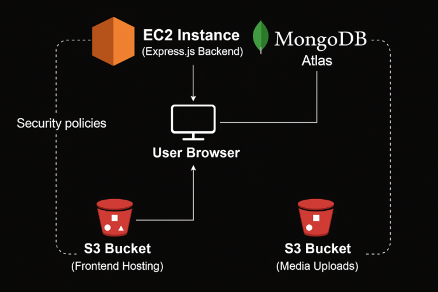

# 🚀 MERN Stack Blog App Deployment - Week 11 Assignment

This repository demonstrates the deployment of a full MERN blog application using **Terraform**, **Ansible**, and **AWS services** as part of the Week 11 Cloud Infrastructure assignment.

---

## 🎯 Assignment Goal

To provision and deploy a production-like MERN stack environment on AWS using infrastructure-as-code tools. This includes:
- Automating infrastructure with Terraform (EC2, IAM, S3, VPC)
- Automating server setup and app deployment with Ansible
- Connecting the backend to MongoDB Atlas
- Hosting the frontend on S3 as a static site
- Enabling secure image upload to a private S3 bucket

---

## 🖼️ Infrastructure Diagram



---

## 🧱 Tools & Services Used

- **Terraform** – Provision AWS resources (EC2, IAM, S3, VPC)
- **Ansible** – Automate backend + frontend setup (with roles)
- **MongoDB Atlas** – NoSQL database hosting
- **AWS EC2** – Host backend API
- **AWS S3** – Host frontend (static) and media (private)
- **PM2** – Manage backend Node.js app

---

## 🛠️ Project Structure

mern-blog-deploy/
├── terraform/ # All Terraform .tf files
├── ansible/ # Ansible playbooks and roles
│ ├── backend-playbook.yml
│ ├── frontend-playbook.yml
│ └── roles/
│ ├── backend/
│ └── frontend/
├── screenshots/ # Required screenshots
└── README.md


---

## 🚀 Deployment Steps

### 1️⃣ Terraform

```bash
cd terraform
terraform init
terraform apply

    Provisions VPC, EC2, IAM user, S3 buckets

    Outputs credentials and public IP

2️⃣ MongoDB Atlas Setup

    Create free-tier cluster

    Create DB user (e.g. sda1027)

    Add EC2 public IP to access list (or 0.0.0.0/0 for testing)

    Get connection string and update Ansible vars/main.yml

3️⃣ Ansible – Backend

ansible-playbook -i inventory ansible/backend-playbook.yml

    Clones project

    Installs Node.js + PM2

    Generates .env using variables

    Starts the app with PM2

4️⃣ Ansible – Frontend

ansible-playbook -i inventory ansible/frontend-playbook.yml

    Builds React frontend using pnpm

    Deploys to public S3 bucket

✅ Success Criteria

    ✔️ Frontend loads from S3 static site

    ✔️ Backend API runs on EC2 and connects to MongoDB Atlas

    ✔️ Media files are uploaded to private S3 bucket

    ✔️ Backend started via Ansible and PM2

🪲 Issues & Fixes (Optional but Valuable)

    Issue: EC2 couldn’t write to logs directory, PM2 status = errored
    Fix: Added /backend/logs folder via Ansible & Terraform user_data

    Issue: aws s3 sync failed — missing permissions
    Fix: Extended IAM policy to allow s3:ListBucket and allowed frontend bucket in policy

    Issue: Terraform error — PutBucketAcl blocked
    Fix: Added aws_s3_bucket_public_access_block to explicitly disable block

📸 Screenshots

Required screenshots (found in /screenshots folder):
Screenshot	Description
diagram.png | Cloud architecture diagram
pm2-backend.png	| PM2 showing backend running
mongodb-cluster.png	| Atlas dashboard showing cluster
media-upload-success.png | Image successfully uploaded
s3-frontend.png	| Frontend visible via S3 static site
EC2-blog-backend-Running.png | EC2 instance status from AWS
Terraform-created successfully.png | Terraform apply success
ansible-playbook -i inventory backend-playbook.yml.png | Backend playbook execution
ansible-playbook -i inventory frontend-playbook.yml.png | Frontend playbook execution


🧼 Cleanup

After completing deployment and testing, all infrastructure was removed using:

terraform destroy

Also:

    Deleted IAM access keys

    Removed .pem key from known hosts

    Ensured .env, .terraform/, and AWS credentials were excluded via .gitignore


🙌 Author

Abdulwahed Alhomaidani (SDA1027)
Assignment – Week 11


